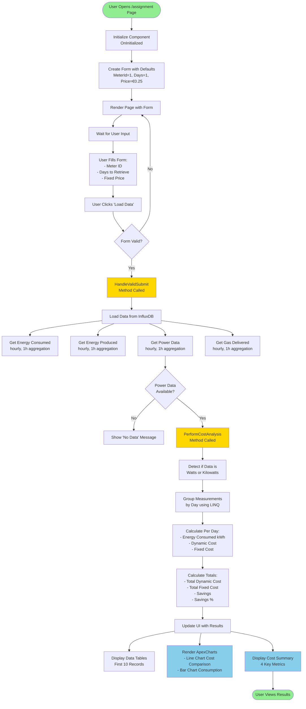
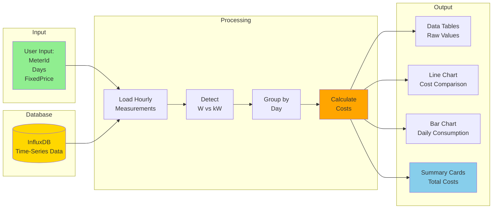
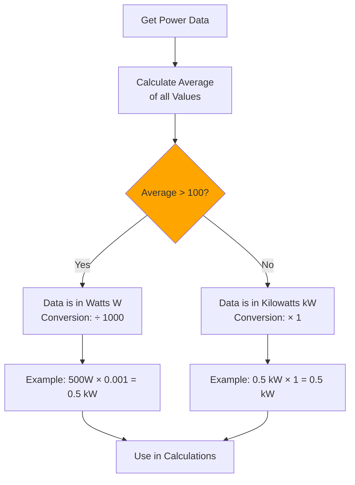
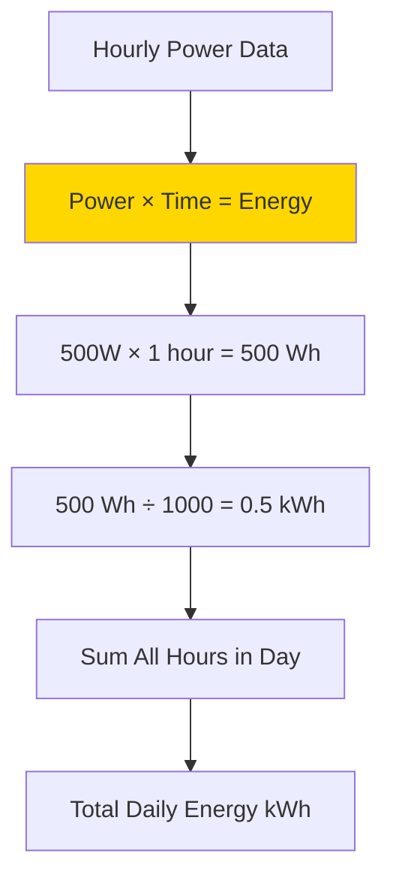
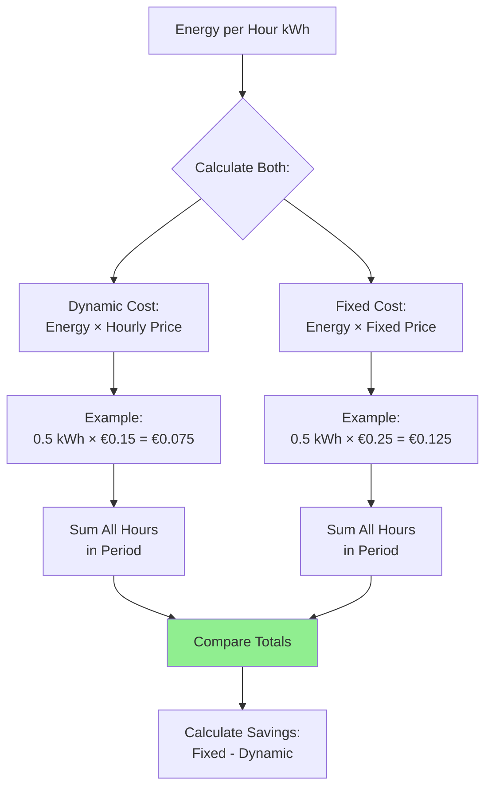
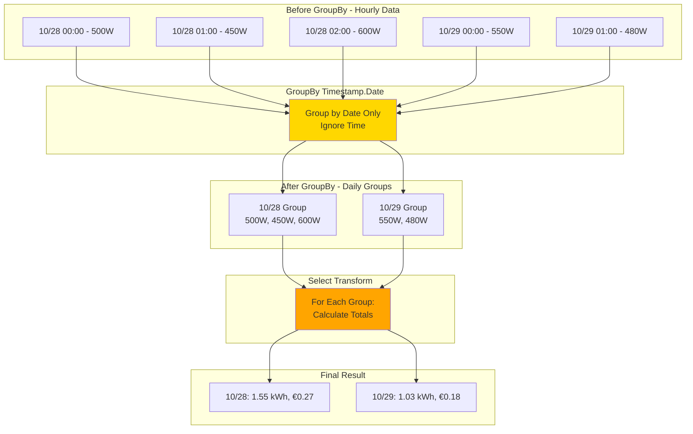

# Smart Energy Cost Analysis - Algorithm Flowchart

## High-Level Application Flow

## Detailed Algorithm Flow - PerformCostAnalysis

```mermaid
flowchart TD
    Start([PerformCostAnalysis<br/>Method Called]) --> CheckNull{PowerData<br/>null or empty?}
    
    CheckNull -->|Yes| LogError[Log: No power data available]
    LogError --> ReturnEarly[Return Early]
    
    CheckNull -->|No| LogDebug[Log Sample Data<br/>First 10 Measurements]
    
    LogDebug --> CalcAvg[Calculate Average<br/>Power Value]
    CalcAvg --> DetectUnit{Average > 100?}
    
    DetectUnit -->|Yes| SetWatts[isWatts = true<br/>powerToKW = 0.001]
    DetectUnit -->|No| SetKW[isWatts = false<br/>powerToKW = 1.0]
    
    SetWatts --> LogUnit[Log Detected Unit]
    SetKW --> LogUnit
    
    LogUnit --> StartLINQ[Start LINQ Query]
    
    StartLINQ --> GroupData[GroupBy Timestamp.Date<br/>Groups all hours by day]
    
    GroupData --> SelectTransform[Select Transform<br/>For Each Day Group:]
    
    SelectTransform --> CalcEnergy[EnergyConsumedKWh =<br/>Sum Value × powerToKW<br/>Physics: Power × Time = Energy]
    
    CalcEnergy --> CalcDynamic[DynamicCost =<br/>Sum Value × powerToKW × EnergyPrice<br/>Uses hourly varying prices]
    
    CalcDynamic --> CalcFixed[FixedCost =<br/>Sum Value × powerToKW × FixedPrice<br/>Uses constant price]
    
    CalcFixed --> OrderData[OrderBy Date<br/>Sort Chronologically]
    
    OrderData --> Materialize[ToList<br/>Execute Query]
    
    Materialize --> SumDynamic[TotalDynamicCost =<br/>Sum all DynamicCost]
    
    SumDynamic --> SumFixed[TotalFixedCost =<br/>Sum all FixedCost]
    
    SumFixed --> CalcSavings[TotalSavings =<br/>FixedCost - DynamicCost]
    
    CalcSavings --> CalcPercent[SavingsPercentage =<br/>Savings / FixedCost × 100]
    
    CalcPercent --> LogResults[Log Detailed Results:<br/>- Per Day Statistics<br/>- Min/Max Power<br/>- Total Costs<br/>- Average Daily kWh]
    
    LogResults --> SanityCheck{Total kWh > 1000<br/>or Daily Avg > 100?}
    
    SanityCheck -->|Yes| LogWarning[Log Warning:<br/>Consumption seems high]
    SanityCheck -->|No| Done
    
    LogWarning --> Done([Analysis Complete<br/>Data Ready for Display])
    
    style Start fill:#FFD700
    style Done fill:#90EE90
    style DetectUnit fill:#FFA500
    style SanityCheck fill:#FFA500
    style GroupData fill:#87CEEB
    style CalcEnergy fill:#87CEEB
    style CalcDynamic fill:#87CEEB
    style CalcFixed fill:#87CEEB
```

## Data Flow Diagram

## Key Algorithm Steps Explained

### Step 1: Unit Detection Logic

### Step 2: Energy Calculation (Physics)

### Step 3: Cost Calculation

## LINQ GroupBy Visualization

---

## How to View These Flowcharts

### Option 1: GitHub/GitLab (Automatic Rendering)
- Push this file to GitHub/GitLab
- They automatically render Mermaid diagrams
- Click the file to view

### Option 2: VS Code Extension
1. Install "Markdown Preview Mermaid Support" extension
2. Open this file in VS Code
3. Press `Ctrl+Shift+V` (Windows) or `Cmd+Shift+V` (Mac)
4. View rendered diagrams

### Option 3: Online Editor
1. Go to https://mermaid.live/
2. Copy-paste any diagram code
3. View and export as PNG/SVG

### Option 4: Obsidian
- Obsidian has built-in Mermaid support
- Just open this file in Obsidian

---

## Summary

This algorithm:
1. **Loads** hourly power consumption data from InfluxDB
2. **Detects** whether data is in Watts or Kilowatts
3. **Groups** measurements by day using LINQ
4. **Calculates** daily energy consumption (kWh)
5. **Compares** costs between dynamic and fixed tariffs
6. **Visualizes** results with charts and summary statistics
7. **Validates** results with sanity checks

**Core Formula:** Cost = Energy (kWh) × Price (€/kWh)

**Key Insight:** Dynamic tariffs save money when you consume energy during cheaper hours.
