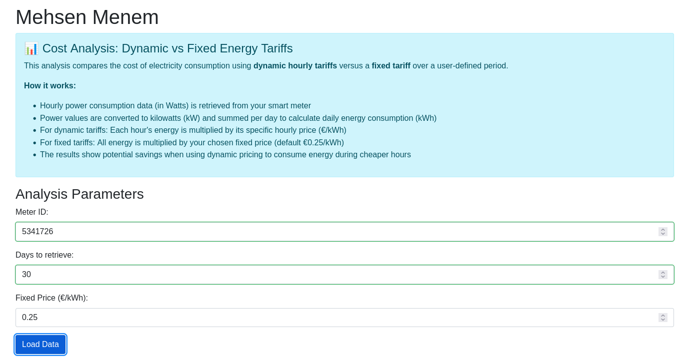
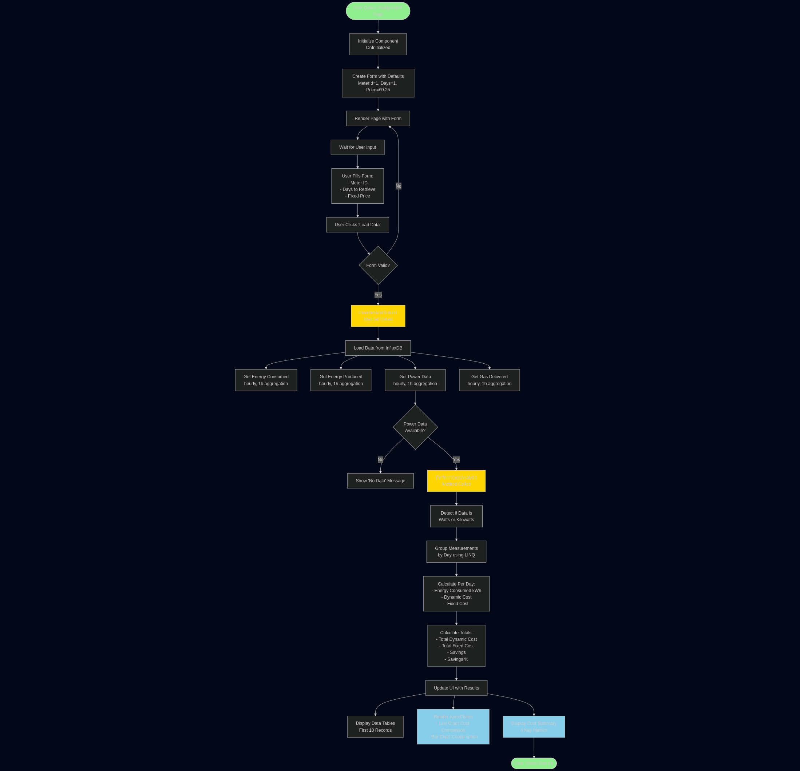
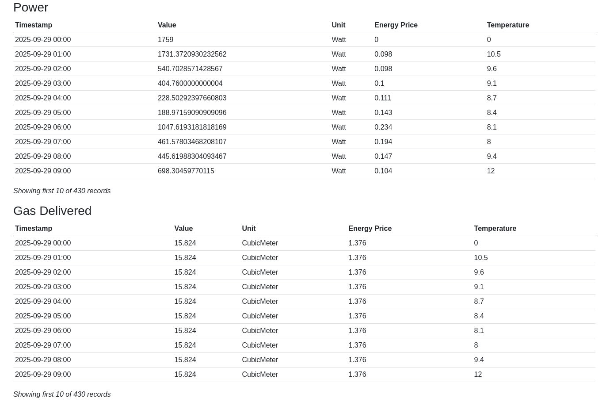
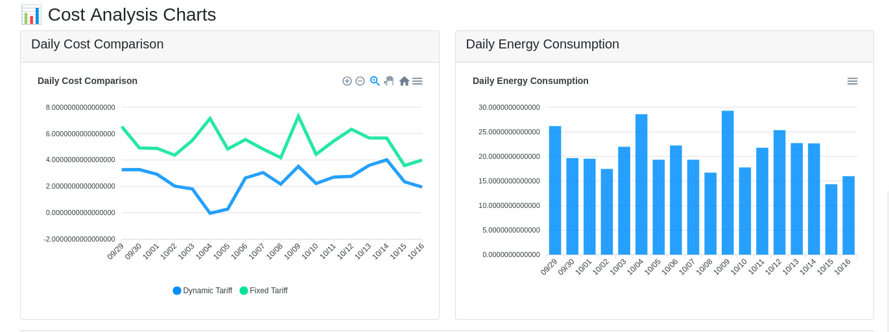
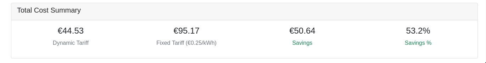

# Werking Applicatie en Acceptatietest

Ik ben bijna klaar met de smart energy applicatie. In deze blogpost vertel ik hoe de applicatie werkt, welke keuzes ik heb gemaakt, en of het algoritme voldoet aan de gestelde eisen.

## Inputdata: Wat heb ik nodig?

Mijn applicatie verwacht drie inputs:

- **MeterID**: De unieke identificatie van jouw slimme meter. Hiermee haal ik de juiste data uit InfluxDB en kun je verschillende huishoudens analyseren.
- **Dagen**: Het aantal dagen waarvoor je data wilt ophalen (minimaal 1, maximaal 90).
- **Vaste tarief**: De prijs voor vergelijking met het dynamische tarief in €/kWh (standaard €0.25).

De applicatie haalt vier soorten data op, maar ik gebruik vooral de **vermogensdata** omdat deze per uur laat zien hoeveel Watt er werd verbruikt. Door dit te combineren met dynamische prijzen kan ik exact berekenen wat het kost.

## Algoritme-ontwerp: Hoe werkt het?

Mijn algoritme volgt deze stappen:

1. **Data ophalen** met "1h" aggregatie (één gemiddelde per uur)
2. **Eenheid detecteren**: Als het gemiddelde boven 100 ligt, is het in Watts – dan deel ik door 1000 om naar kilowatts te converteren
3. **Groeperen per dag** met LINQ
4. **Energie berekenen**: Vermogen × Tijd = Energie (500W × 1 uur = 0.5 kWh)
5. **Kosten berekenen**: Dynamisch gebruikt elk uur zijn specifieke prijs, vast gebruikt altijd dezelfde prijs
6. **Totalen optellen** en besparing berekenen

**Voorbeeld**: Een dag met 24 metingen van gemiddeld 800W per uur. Totale energie: 24 × 0.8 kWh = 19.2 kWh. Bij dynamisch tarief (gemiddeld €0.15/kWh): 19.2 × €0.15 = €2.88. Bij vast tarief (€0.25/kWh): 19.2 × €0.25 = €4.80. Besparing: €1.92 (40%). Bij piekuren (€0.35/kWh) zou vast juist goedkoper zijn.

## Resultaten: Wat zie je?

De applicatie toont drie soorten resultaten:

**Tabellen** met de ruwe data. Hier zie je de eerste 10 regels van vermogen en gas:

Je ziet direct de Watt-waarden per uur en de bijbehorende energieprijzen. Bijvoorbeeld op 2025-09-29 om 06:00 was de prijs €0.234/kWh (piekuur!), terwijl om 02:00 het slechts €0.098/kWh was.

**Grafieken** voor visuele analyse:

De lijngrafiek toont dat het vaste tarief (groen) consistent boven het dynamische tarief (blauw) ligt. Het staafdiagram laat variërend dagelijks verbruik zien.

**Kosten-overzicht** met de eindcijfers:

Voor 30 dagen zie je: €44.53 met dynamisch, €95.17 met vast tarief – een besparing van €50.64 (53.2%!).

Wat opviel: besparingen van 53% zijn hoger dan verwacht (10-20%), door grote prijsverschillen dag/nacht. Aanvankelijk waren kosten in de *miljoenen* – een Watts/kW bug gevonden door sanity checks. Ook zag ik: dynamisch is niet altijd goedkoper bij veel verbruik tijdens piekuren (€0.234/kWh om 06:00).

## Acceptatiecriteria en testen

De opdracht vroeg om webpagina met naam, algoritme-beschrijving, dagelijkse berekeningen, vergelijking en totalen. Alles gerealiseerd, plus grafieken en multi-huishouden support.

Ik testte door handmatige verificatie, sanity checks, en variërende inputs (1, 7, 30 dagen). Onverwachte bevinding: dynamisch is niet automatisch goedkoper.

## Reflectie per fase

**Ontwerpfase**: Ik begon direct met coderen zonder flowchart. Voordeel: snelle iteratie. Nadeel: onduidelijke structuur leidde tot de Watts/kW bug. Voor volgende projecten maak ik eerst visuele ontwerpen.

**Implementatiefase**: LINQ werkte perfect voor data-aggregatie, maar ik miste unit tests. De sanity checks (waarschuwingen bij >100 kWh/dag) redden me wel. Volgende keer: eerst tests schrijven, dan implementeren.

**Testfase**: Handmatige verificatie werkte maar was tijdrovend. Geautomatiseerde tests zouden efficiënter zijn geweest. Het testen met verschillende periodes (1, 7, 30 dagen) hielp onverwachte patronen ontdekken.

**Lessen**: Altijd flowchart vooraf, edge cases documenteren in requirements, en grafieken eerder toevoegen voor snellere validatie.

## Terugkijkend: Lost dit het probleem op?

In mijn eerste blogpost noemde ik drie SDG's: **SDG 7.3** (energie-efficiëntie door inzicht in verbruik), **SDG 11.6** (milieu-impact door verbruiksverschuiving), en **SDG 13.2** (klimaatmaatregelen door hernieuwbare energie beter te integreren).

Draagt mijn applicatie hieraan bij? **Ja, deels.** Het is een belangrijke eerste stap: bewustwording. De grafieken tonen duidelijk wanneer stroom goedkoop is (vaak als er veel zon/wind is), wat mensen helpt bewuster te kiezen wanneer ze apparaten aanzetten.

Privacy heb ik gerespecteerd: data wordt alleen geaggregeerd per dag getoond. Kortom: de applicatie helpt mensen bewuster omgaan met energie en draagt bij aan SDG 7, 11 en 13. Het is geen volledige oplossing, maar een solide fundament.
